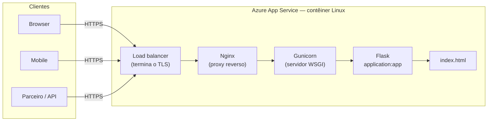

# Prática 0 — Publicando um `index.html` pessoal no Azure App Service

Objetivo: subir uma página (`index.html`) servida por uma aplicação
**Flask + Gunicorn** no **Azure App Service** (contêiner Linux).

> Passos validados com a documentação oficial da Microsoft (jul/2026):
> [Quickstart: Deploy a Python web app](https://learn.microsoft.com/en-us/azure/app-service/quickstart-python)
> e [Configure a Linux Python app](https://learn.microsoft.com/en-us/azure/app-service/configure-language-python).

---

## Como a requisição chega até a sua página



O Azure já coloca **Nginx + Gunicorn** na frente da sua aplicação. Você só
entrega o código Flask; a plataforma cuida de TLS, proxy e processo.

---

## 1. Estrutura do projeto

Crie uma pasta com os três arquivos abaixo, **na raiz** (o Azure procura o
`requirements.txt` e o `application.py` na raiz do que for publicado):

```text
0.webapp/
├── application.py       # aplicação Flask (ponto de entrada)
├── index.html           # sua página pessoal
└── requirements.txt     # dependências (Flask e gunicorn)
```

### `requirements.txt`

```text
Flask
gunicorn
```

### `application.py`

```python
import os

from flask import Flask, send_from_directory

app = Flask(__name__)
BASE_DIR = os.path.dirname(os.path.abspath(__file__))


@app.route("/")
def index():
    return send_from_directory(BASE_DIR, "index.html")


if __name__ == "__main__":
    app.run(host="0.0.0.0", port=8000)
```

> O App Service detecta automaticamente um app Flask quando existe um arquivo
> `application.py` (ou `app.py`) na raiz com um objeto WSGI chamado `app`. Por
> isso o alvo do Gunicorn é `application:app`.

### `index.html`

```html
<!doctype html>
<html lang="pt-br">
  <head>
    <meta charset="utf-8" />
    <meta name="viewport" content="width=device-width, initial-scale=1" />
    <title>Minha página pessoal</title>
  </head>
  <body>
    <h1>Olá! Esta é a minha página no Azure 🚀</h1>
    <p>Publicada com Flask + Gunicorn no Azure App Service.</p>
  </body>
</html>
```

---

## 2. Testar localmente (opcional, mas recomendado)

```bash
python3 -m venv .venv
source .venv/bin/activate          # Windows: .venv\Scripts\activate
pip install -r requirements.txt
python3 -m gunicorn application:app
```

Acesse `http://localhost:8000` e confira se o `index.html` aparece.

---

## 3. Criar o Web App no Azure

1. Portal do Azure → busque **App Services** → **+ Create** → **Web App**.
2. Preencha:
   - **Resource Group**: crie um novo (ex.: `rg-webapp-pessoal`).
   - **Name**: nome único (vira a URL `https://<name>.azurewebsites.net`).
   - **Publish**: `Code`.
   - **Runtime stack**: `Python 3.13` (ou a versão mais recente disponível).
   - **Operating System**: `Linux` (única opção para Python; Windows foi descontinuado).
   - **Region**: a mais próxima de você.
   - **Pricing plan**: `F1` (Free) serve para a prática — o `B1` é recomendado
     pela Microsoft por desempenho, mas tem custo.
3. **Review + create** → **Create**.

---

## 4. Configurar o comando de inicialização (Startup Command)

> **Quando é necessário?** Para este cenário (arquivo `application.py`, objeto
> `app`), o App Service **já inicia o Gunicorn sozinho** com:
> `gunicorn --bind=0.0.0.0 --timeout 600 application:app`.
> Configure um Startup Command apenas se quiser argumentos extras (workers,
> logs) ou se o arquivo/objeto tiver outro nome.

No recurso do Web App:

**Settings → Configuration → aba General settings → campo Startup Command**

```text
gunicorn --bind=0.0.0.0 --timeout 600 application:app
```

Clique em **Save** e aguarde a notificação de reinício.

> A forma `python3 -m gunicorn application:app` também funciona, mas a sintaxe
> acima é a documentada pela Microsoft (o contêiner já tem o `gunicorn` no PATH).

---

## 5. Fazer o deploy do código

Escolha **uma** das opções:

### Opção A — VS Code (mais simples)

1. Instale a extensão **Azure App Service** (ou o pacote **Azure Tools**).
2. Faça login na sua conta Azure pelo VS Code.
3. Botão direito na pasta do projeto → **Deploy to Web App...** → selecione o Web App.
4. Aceite **atualizar a configuração de build** quando perguntado (isso liga o
   build no servidor, que instala o `requirements.txt`).

### Opção B — Deployment Center (GitHub / Git local)

**Deployment Center** → escolha a fonte (GitHub Actions ou Local Git) e siga o
assistente. O build no servidor é ligado automaticamente nesse fluxo.

> **Deploy por ZIP pelo portal:** antes, adicione em
> **Settings → Configuration → Application settings** a variável
> `SCM_DO_BUILD_DURING_DEPLOYMENT = true`, senão as dependências não são instaladas.

---

## 6. Validar

Acesse (link também em **Overview → Default domain**):

```text
https://<nome-do-webapp>.azurewebsites.net
```

A página `index.html` deve carregar.

### Se algo der errado

- **Ativar logs**: `Monitoring → App Service logs` → **Application logging**: `File System` → **Save**.
- **Ver logs**: `Monitoring → Log stream`.
- Se aparecer a **página padrão do Azure**: o código não foi encontrado —
  confira se `application.py` e `requirements.txt` estão na **raiz** do deploy
  e reinicie o app (**Overview → Restart**).
- Se aparecer **"Service Unavailable"**: o Gunicorn subiu mas o Flask não —
  veja o erro no Log stream; confirme o nome do objeto (`app`).
- **Diagnóstico guiado**: `Diagnose and solve problems` no menu do Web App.

---

## Resumo dos passos

| # | Passo |
|---|-------|
| 1 | Criar `application.py`, `index.html` e `requirements.txt` (Flask e gunicorn) na raiz |
| 2 | Testar localmente com `python3 -m gunicorn application:app` |
| 3 | Criar Web App no Azure (Python / Linux / F1) |
| 4 | (Opcional) Settings → Configuration → General settings → Startup Command: `gunicorn --bind=0.0.0.0 --timeout 600 application:app` |
| 5 | Deploy do código (VS Code ou Deployment Center) — com build no servidor ligado |
| 6 | Acessar `https://<nome>.azurewebsites.net` e validar pelo Log stream |
