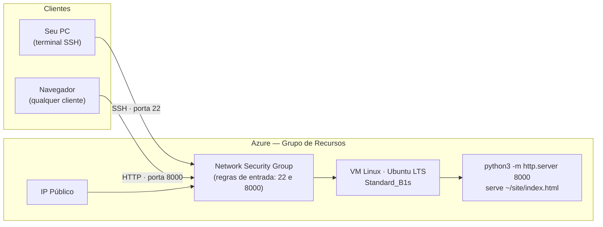

# Laboratório Prático — Criando uma Máquina Virtual no Azure e Hospedando um Servidor Web

> Passos e comandos revisados em set/2026 com a documentação oficial:
> [Quickstart: criar VM Linux no portal](https://learn.microsoft.com/en-us/azure/virtual-machines/linux/quick-create-portal)
> e [via Azure CLI](https://learn.microsoft.com/en-us/azure/virtual-machines/linux/quick-create-cli).

---

## Objetivos de Aprendizagem

Ao final deste laboratório, você será capaz de:

1. Provisionar uma **Máquina Virtual (VM)** Linux no Azure utilizando o portal (interface gráfica).
2. Configurar **regras de segurança de rede (NSG)** para permitir tráfego SSH e HTTP.
3. Conectar-se à VM via **SSH** a partir do seu computador.
4. Subir um **servidor web simples** (Python HTTP Server) e validar o acesso público.
5. Encerrar e remover recursos para evitar custos desnecessários.

---

## O que você vai precisar

- Navegador moderno (Edge, Chrome ou Firefox)
- Acesso ao portal: <https://portal.azure.com>
- Terminal com cliente SSH:
  - **Windows 10/11:** PowerShell ou Windows Terminal (já vem com `ssh`)
  - **Linux/macOS:** terminal nativo
- Cerca de **R$ 0,00 a R$ 5,00** em créditos (se você usar Free Tier e destruir a VM ao final, o custo é zero)

> **Atenção sobre custos:** VMs no Azure são cobradas por hora. Sempre **pare** ou **delete** os recursos ao terminar o laboratório.

---

## Visão Geral da Arquitetura



---

## Roteiro do Laboratório

### Parte 1 — Criar o Grupo de Recursos
### Parte 2 — Provisionar a Máquina Virtual
### Parte 3 — Configurar regras de rede (NSG)
### Parte 4 — Conectar via SSH
### Parte 5 — Subir o servidor web Python
### Parte 6 — Validar o acesso público
### Parte 7 — Limpeza dos recursos

---

## Parte 1 — Criar o Grupo de Recursos

Um **Resource Group** (Grupo de Recursos) é um contêiner lógico que agrupa recursos relacionados. Facilita organização e exclusão em massa.

### Passo 1.1 — Acessar o portal

1. Abra <https://portal.azure.com> e faça login.
2. No campo de busca superior, digite **"Grupos de recursos"** e clique no resultado.

### Passo 1.2 — Criar o grupo

1. Clique em **+ Criar**.
2. Preencha os campos:

| Campo                         | Valor                                     |
| ----------------------------- | ----------------------------------------- |
| **Assinatura**                | (selecione a sua)                         |
| **Nome do grupo de recursos** | `rg-lab-webserver`                        |
| **Região**                    | `(US) East US` ou `(Brazil) Brazil South` |

3. Clique em **Revisar + criar** → **Criar**.
4. Aguarde a notificação de "Implantação concluída".

> **Dica:** Use sempre prefixos descritivos: `rg-` para resource group, `vm-` para VM, `vnet-` para virtual network. Isso facilita a governança.

---

## Parte 2 — Provisionar a Máquina Virtual

### Passo 2.1 — Iniciar a criação

1. Na barra de busca, digite **"Máquinas virtuais"** e abra o serviço.
2. Clique em **+ Criar** → **Máquina virtual do Azure**.

### Passo 2.2 — Aba "Informações Básicas"

Preencha conforme a tabela abaixo:

| Campo                         | Valor                                                      |
| ----------------------------- | ---------------------------------------------------------- |
| **Assinatura**                | (sua assinatura)                                           |
| **Grupo de recursos**         | `rg-lab-webserver`                                         |
| **Nome da máquina virtual**   | `vm-webserver-01`                                          |
| **Região**                    | a mesma do grupo de recursos                               |
| **Opções de disponibilidade** | `Nenhuma redundância de infraestrutura necessária`         |
| **Tipo de segurança**         | `Inicialização Confiável` (Trusted Launch — padrão atual; pode manter) |
| **Imagem**                    | `Ubuntu Server 24.04 LTS - x64 Gen2` (ou `22.04 LTS` se preferir) |
| **Arquitetura da VM**         | `x64`                                                      |
| **Tamanho**                   | `Standard_B1s` (1 vCPU, 1 GiB RAM — elegível ao Free Tier) |

### Passo 2.3 — Conta de Administrador

| Campo                           | Valor                      |
| ------------------------------- | -------------------------- |
| **Tipo de autenticação**        | `Chave pública SSH`        |
| **Nome de usuário**             | `azureuser`                |
| **Origem da chave pública SSH** | `Gerar novo par de chaves` |
| **Nome do par de chaves SSH**   | `vm-webserver-01_key`      |

### Passo 2.4 — Regras de Porta de Entrada

| Campo                            | Valor                          |
| -------------------------------- | ------------------------------ |
| **Portas de entrada públicas**   | `Permitir portas selecionadas` |
| **Selecionar portas de entrada** | `SSH (22)`                     |

> **Não habilite HTTP (80) aqui ainda!** Vamos abrir a porta `8000` manualmente na Parte 3, pois é a porta padrão do servidor Python.

### Passo 2.5 — Disco

Mantenha os valores padrão:
- **Tipo de disco do SO:** `Standard SSD`
- **Excluir o disco com a VM:** marcado

### Passo 2.6 — Rede

Mantenha os valores padrão (o Azure cria VNet, subnet, IP público e NSG automaticamente). Apenas confirme:

| Campo                                 | Valor                       |
| ------------------------------------- | --------------------------- |
| **IP público**                        | `(novo) vm-webserver-01-ip` |
| **Grupo de segurança de rede da NIC** | `Básico`                    |

### Passo 2.7 — Revisar e Criar

1. Clique em **Revisar + criar**.
2. Aguarde a validação ("Validação aprovada").
3. Clique em **Criar**.
4. Quando solicitado, **baixe a chave privada** (`vm-webserver-01_key.pem`) e clique em **Criar recurso**.

> **IMPORTANTE:** Guarde o arquivo `.pem` em local seguro. **Sem ele você não conseguirá entrar na VM.**

5. Aguarde **3 a 5 minutos** até o status mudar para "Sua implantação está concluída".

---

## Parte 3 — Configurar a Regra para a Porta 8000

O Python HTTP Server escuta na porta `8000`. Precisamos liberá-la no NSG (Network Security Group).

### Passo 3.1 — Acessar o NSG

1. Vá para a sua VM `vm-webserver-01`.
2. No menu lateral, clique em **Rede** → aba **Configurações de rede**.
3. Você verá a lista de regras de entrada existentes (deve haver uma para SSH).

### Passo 3.2 — Criar regra para a porta 8000

1. Clique em **Criar regra de porta** → **Regra de porta de entrada**.
2. Preencha:

| Campo                               | Valor             |
| ----------------------------------- | ----------------- |
| **Origem**                          | `Any`             |
| **Intervalos de portas de origem**  | `*`               |
| **Destino**                         | `Any`             |
| **Serviço**                         | `Personalizado`   |
| **Intervalos de portas de destino** | `8000`            |
| **Protocolo**                       | `TCP`             |
| **Ação**                            | `Permitir`        |
| **Prioridade**                      | `310`             |
| **Nome**                            | `Allow-HTTP-8000` |

3. Clique em **Adicionar**.

> **Por que prioridade 310?** Regras com número menor têm precedência. A regra de SSH criada junto com a VM costuma ficar em 300 (às vezes 1000); qualquer valor livre entre 100 e 4096 serve — 310 mantém a lista organizada. Se o portal reclamar de prioridade em uso, escolha outro número.

---

## Parte 4 — Conectar via SSH

### Passo 4.1 — Capturar o IP Público

1. Volte à página da VM `vm-webserver-01`.
2. No painel **Visão geral**, copie o valor de **Endereço IP público** (ex.: `20.121.45.78`).

### Passo 4.2 — Ajustar permissões da chave (Linux/macOS)

```bash
chmod 400 ~/Downloads/vm-webserver-01_key.pem
```

No **Windows (PowerShell)**, geralmente não é necessário ajustar permissões, mas se der erro, mova o `.pem` para sua pasta de usuário e use:

```powershell
icacls.exe "$HOME\vm-webserver-01_key.pem" /reset
icacls.exe "$HOME\vm-webserver-01_key.pem" /grant:r "$($env:USERNAME):(R)"
icacls.exe "$HOME\vm-webserver-01_key.pem" /inheritance:r
```

### Passo 4.3 — Conectar

```bash
ssh -i ~/Downloads/vm-webserver-01_key.pem azureuser@<IP_PUBLICO>
```

Substitua `<IP_PUBLICO>` pelo IP copiado. Na primeira conexão, digite **`yes`** para aceitar a fingerprint.

Você deve ver algo como:

```
Welcome to Ubuntu 22.04.4 LTS (GNU/Linux 6.5.0-1023-azure x86_64)
azureuser@vm-webserver-01:~$
```

**Você está dentro da sua VM na nuvem!**

---

## Parte 5 — Subir o Servidor Web Python

### Passo 5.1 — Atualizar o sistema (boa prática)

```bash
sudo apt update && sudo apt upgrade -y
```

### Passo 5.2 — Verificar o Python

O Ubuntu já vem com Python 3 pré-instalado:

```bash
python3 --version
```

Saída esperada (a versão varia conforme a imagem):
```
Python 3.12.x   # Ubuntu 24.04
Python 3.10.x   # Ubuntu 22.04
```

### Passo 5.3 — Criar uma página HTML de demonstração

```bash
mkdir ~/site && cd ~/site
cat > index.html <<'EOF'
<!DOCTYPE html>
<html lang="pt-BR">
<head>
  <meta charset="UTF-8">
  <title>Lab Cloud — VM Azure</title>
  <style>
    body { font-family: sans-serif; background:#0a2540; color:#fff;
           display:flex; align-items:center; justify-content:center;
           height:100vh; margin:0; text-align:center; }
    h1 { font-size: 3rem; }
    code { background:#1a3a5c; padding:4px 8px; border-radius:4px; }
  </style>
</head>
<body>
  <div>
    <h1>Servidor no Ar!</h1>
    <p>Hospedado em uma <code>VM Linux</code> no Microsoft Azure.</p>
    <p>Disciplina: <strong>Cloud Computing</strong></p>
  </div>
</body>
</html>
EOF
```

### Passo 5.4 — Subir o servidor

```bash
python3 -m http.server 8000
```

Saída esperada:
```
Serving HTTP on 0.0.0.0 port 8000 (http://0.0.0.0:8000/) ...
```

> O parâmetro `0.0.0.0` faz o servidor escutar em **todas as interfaces de rede**, permitindo o acesso externo. Se fosse `127.0.0.1`, só aceitaria conexões locais.

**Não feche este terminal** — o servidor precisa continuar em execução.

---

## Parte 6 — Validar o Acesso Público

Em um navegador no seu computador, acesse:

```
http://<IP_PUBLICO>:8000
```

Você deve ver a página **"Servidor no Ar!"** que criamos.

### Checkpoint de Validação

| Teste                                          | Resultado esperado  |
| ---------------------------------------------- | ------------------- |
| `ssh azureuser@<IP>` funciona                  |                     |
| `python3 -m http.server 8000` executa sem erro |                     |
| Navegador abre `http://<IP>:8000`              | Página HTML visível |
| Logs aparecem no terminal SSH a cada acesso    |                     |

> **Não funcionou?** Confira:
> - A regra `Allow-HTTP-8000` está em **Rede** da VM?
> - Você usou `http://` (e não `https://`)?
> - O servidor Python ainda está rodando no SSH?

---

## Parte 7 — Limpeza dos Recursos (CRÍTICO)

> **Esqueça este passo e a fatura virá!** Sempre destrua o que não está usando.

### Opção A — Apagar tudo de uma vez (recomendado)

1. No portal, vá em **Grupos de recursos**.
2. Clique em `rg-lab-webserver`.
3. Clique em **Excluir grupo de recursos**.
4. Digite o nome do grupo para confirmar e clique em **Excluir**.

Em ~5 minutos, **todos** os recursos (VM, disco, IP, NIC, NSG, VNet) serão removidos.

### Opção B — Apenas parar a VM (mantém os recursos)

1. Vá à VM → clique em **Parar** (Stop).
2. Você ainda paga pelo **disco** e **IP público estático**, mas não pela computação.

---

## Atividades Complementares

Para fixar o aprendizado, tente:

1. **Trocar o servidor Python pelo Nginx:**
   ```bash
   sudo apt install -y nginx
   sudo systemctl status nginx
   ```
   Não esqueça de abrir a porta `80` no NSG.

2. **Manter o servidor rodando após fechar o SSH** usando `nohup` ou `tmux`:
   ```bash
   nohup python3 -m http.server 8000 > server.log 2>&1 &
   ```

3. **Configurar um nome DNS** para a VM (em Configurações → Configuração da rede da VM → IP público → Nome DNS).

4. **Criar a mesma VM via Azure CLI** para comparar a velocidade:
   ```bash
   az vm create --resource-group rg-lab-webserver \
     --name vm-cli-01 --image Ubuntu2404 \
     --size Standard_B1s \
     --admin-username azureuser --generate-ssh-keys \
     --public-ip-sku Standard

   # abrir a porta 8000 no NSG criado pela CLI
   az vm open-port --resource-group rg-lab-webserver \
     --name vm-cli-01 --port 8000 --priority 310
   ```

   > O SKU `Básico` de IP público foi aposentado em set/2025 — por isso `--public-ip-sku Standard` (hoje já é o padrão da CLI, mas deixe explícito). Os aliases `Ubuntu2404` e `Ubuntu2204` continuam válidos.

---

## Para Refletir

- **Por que não usamos a porta 80 diretamente?** Portas abaixo de 1024 exigem privilégio de root no Linux. Em produção, costuma-se usar um servidor como **Nginx** rodando como root e fazer **proxy reverso** para a aplicação rodando em portas altas.
- **Quando faz sentido usar uma VM em vez de App Service ou Container?** Quando você precisa de controle total do SO, instalar pacotes específicos, ou rodar serviços que não cabem em PaaS.
- **O que é um NSG e como ele se relaciona com firewalls tradicionais?** O NSG funciona como um firewall de rede stateful, aplicado em nível de NIC ou subnet.

---

## Entregáveis (se for atividade avaliativa)

1. **Print do navegador** mostrando a página HTML servida pela sua VM (com o IP visível na barra de endereço).
2. **Print do terminal SSH** mostrando o log do `python3 -m http.server`.
3. **Print do portal Azure** confirmando que o grupo de recursos foi **excluído** ao final.

---
